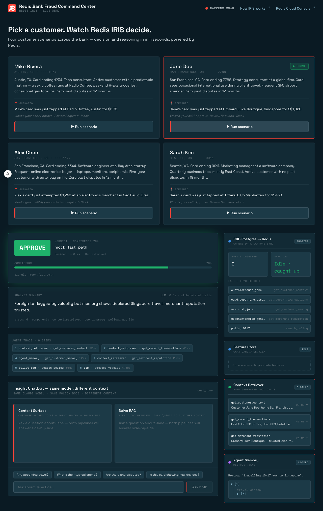
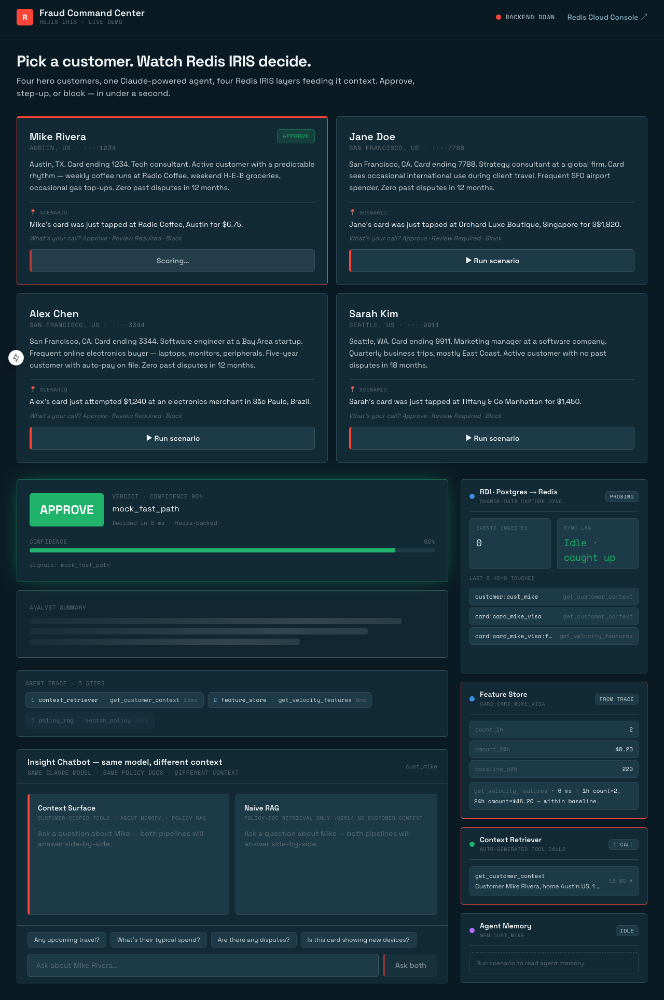
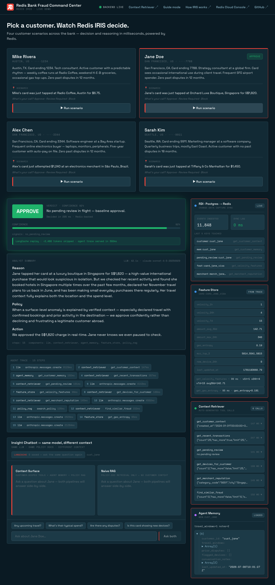
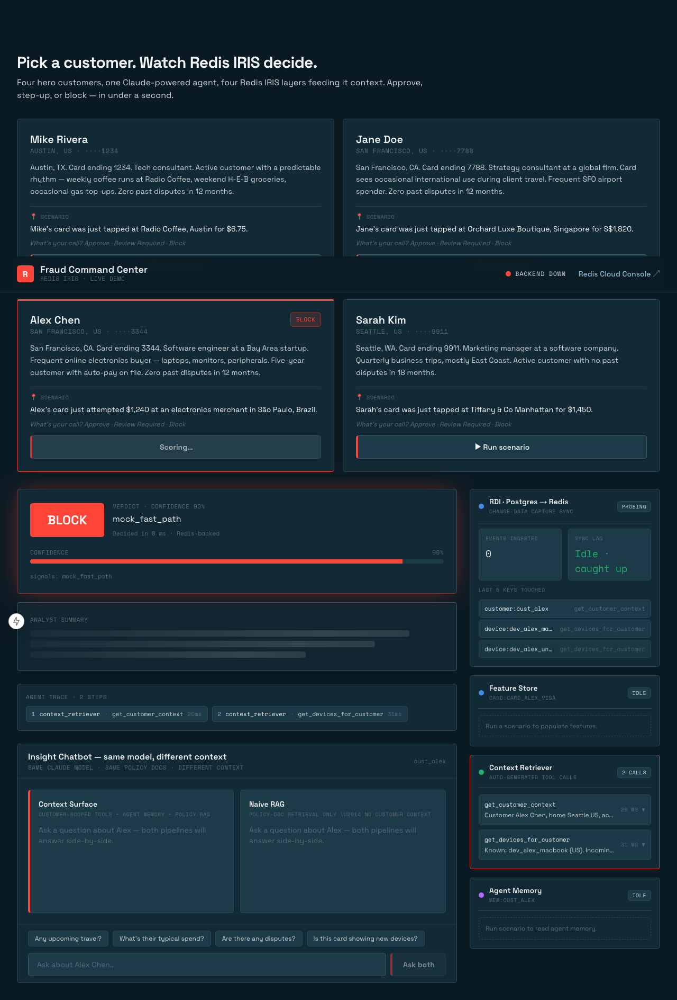
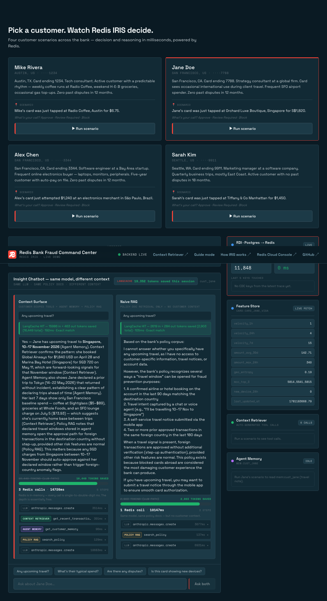
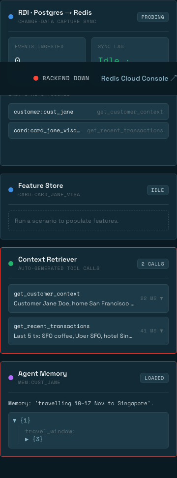

# Presenter Runbook — Fraud Command Center

Single page. Read it once the morning of the webinar; you should not need to
re-read it on stage. The whole demo is ~15 minutes: 3 minutes per hero
customer (four heroes) + 3 minutes for the chatbot comparison.

> **Mantra (memorize this line):** *Same Claude model. Same policy docs.
> Different context.*

---

## Pre-flight (T-30 min)

### 1. Environment

`.env` must contain values for the following variable **names** (never
print or screen-share the values):

| Variable             | Purpose                                                    |
| -------------------- | ---------------------------------------------------------- |
| `REDIS_URL`          | Redis Cloud connection string                              |
| `CTX_ADMIN_KEY`      | Context Retriever admin key (only needed for `make context-up`) |
| `CTX_SURFACE_ID`     | Auto-filled by `make context-up`                           |
| `CTX_AGENT_KEY`      | Auto-filled by `make context-up`                           |
| `ANTHROPIC_API_KEY`  | Claude Sonnet key (required when `AGENT_MODE=claude`)      |
| `AGENT_MODE`         | `claude` (live demo) or `stub` (offline rehearsal fallback) |

`.env.example` at the repo root is the canonical list — copy it, fill it
in, never commit it.

#### Customizing TopBar links for your tenancy

The three links in the page header are sourced from `NEXT_PUBLIC_*` env
vars baked at frontend build time. Set `NEXT_PUBLIC_REDIS_CLOUD_URL` (your
Redis Cloud database "Open Database" URL), `NEXT_PUBLIC_CONTEXT_RETRIEVER_URL`
(your Context Retriever surface page), and `NEXT_PUBLIC_GITHUB_URL` (this
demo's repo) in `.env`. Leave Context Retriever / GitHub blank to hide those
links. After changing any of them, rebuild the frontend:

```bash
docker compose -f infra/docker-compose.yml --env-file .env build frontend
docker compose -f infra/docker-compose.yml --env-file .env up -d frontend
```

### 2. Bring the stack up

```bash
docker compose -f infra/docker-compose.yml --env-file .env up -d --build
# or simply:
make demo
```

`make demo` waits for backend health, then opens
<http://localhost:3000> automatically.

### 3. First-run-only one-shots

Run these **once per fresh checkout / fresh Redis Cloud DB**, then never
again:

| Command            | When to run it                                                |
| ------------------ | ------------------------------------------------------------- |
| `make seed`        | Postgres is empty (no `cust_mike` / `cust_jane` / `cust_alex`).|
| `make context-up`  | Context Retriever surface not provisioned (no `CTX_AGENT_KEY` in `.env`). |
| `make policy-index`| RediSearch `idx:policies` missing or after a policy-doc edit. |

### 4. Sanity checklist (60 seconds)

- [ ] <http://localhost:3000> loads and the three hero cards render.
- [ ] Clicking **Run scenario** on Jane returns an `APPROVE` verdict in <1 s.
- [ ] Redis Insight (presenter side, not in the repo) is connected to the
      same Redis Cloud DB and can browse `customer:cust_jane`,
      `mem:cust_jane`, and `stream:transactions`.
- [ ] `AGENT_MODE=claude` in `.env` if Anthropic is reachable, otherwise
      `AGENT_MODE=stub` (see Recovery → "Anthropic API rate-limit").

### 5. Proxy architecture (FYI)

Browser `/api/*` calls are forwarded to the backend by a Next.js catch-all
route handler at `frontend/app/api/[...path]/route.ts` — *not* by
`next.config.mjs` `rewrites()`. The handler disables HTTP keep-alive and
retries once on transient connect errors so `docker compose restart backend`
(which gives the backend a new container IP) is invisible to the running
frontend. Do not reintroduce `rewrites()`; it caches dead sockets and breaks
the demo after every backend rebuild.



---

## The three beats (≈3 min each)

The dashboard puts all three customers side-by-side. Each card now
runs as a **quiz**: bio + in-flight scenario only — no verdict spoiler
until you hit **Run scenario**. The card animates the verdict chip in
~250 ms (fast path), then the LLM-narrated reason fills in afterward.

### Demo arc — the misdirection

Use the three beats as a sequence, not three independent demos:

1. **Mike calibrates the room.** Boring scenario, the audience guesses
   *approve* and gets it right. Establishes that the system can be
   trusted on the easy cases.
2. **Jane flips them toward block.** Foreign country + luxury merchant
   looks like fraud at a glance. Most of the audience will call
   *block*. Redis says **approve** because Agent Memory holds Jane's
   declared travel window + the departure-arc evidence.
3. **Alex flips them toward approve.** Friendly bio (five-year
   customer, zero disputes, software engineer) tempts the audience
   toward *approve*. Redis says **block** because the Feature Store
   surfaces a first-seen device + impossible-travel velocity, and the
   Context Retriever shows Alex has never travelled internationally.

Each beat below uses the same two-cue pattern:
**Before run:** *"What do you think? Approve, step-up, or block?"*
(pause, let the room commit). **After verdict reveals:** *"Let's see
what our agent says…"* — then — *"Now let's see why: same model, same
policy docs, different context."* (gesture to the trace and IRIS rail).

### Beat 1 — Mike Rivera 🟢 *(steady state)*

- **What to click:** Mike's card → **Run scenario**.
- **Before run:** *"What do you think? Approve, step-up, or block?"*
  (audience guesses approve correctly).
- **After verdict:** *"Let's see what our agent says…"* — `APPROVE`
  lands instantly. *"Now let's see why — same model, same policy docs,
  different context."*
- **What to say:** *"A bank runs millions of decisions like this every
  day. Routine $6.75 coffee in Austin — the Feature Store says 'normal
  velocity, normal merchant, normal geo' and the agent approves in
  sub-50 ms. No human in the loop."*
- **Point at:** the **Feature Store** panel — emphasize that the keys
  came from `feat:card_mike_visa`.
- **Expected verdict:** `APPROVE` with high confidence.
- **Why this matters:** the boring path. Most decisions never touch a
  human because Redis answered "is this normal?" in single-digit ms.



### Beat 2 — Jane Doe 🟡 *(the near-miss)*

- **What to click:** Jane's card → **Run scenario**.
- **Before run:** *"What do you think? Approve, step-up, or block?"*
  (most of the room will call **block** — foreign + luxury).
- **After verdict:** *"Let's see what our agent says…"* — `APPROVE`
  drops in. Pause for the audience reaction. *"Now let's see why —
  same model, same policy docs, different context."*
- **What to say:** *"$480 luxury boutique in Singapore. By features
  alone this screams fraud — foreign country, high amount. Watch what
  Redis does."*
- **Point at:** the **Context Retriever** panel (calls populate live)
  and then the **Agent Memory** panel showing
  `Memory: 'travelling 10–17 Nov to Singapore'`.
- **Expected verdict:** `APPROVE` — flipped from the naive "block"
  because of memory + merchant reputation.
- **Why this matters:** the **false-positive cost** moment. Without
  IRIS, the bank blocks Jane mid-transaction, embarrasses her in front
  of a shop assistant, and loses her loyalty.



### Beat 3 — Alex Chen 🔴 *(fraud caught)*

- **What to click:** Alex's card → **Run scenario**.
- **Before run:** *"What do you think? Approve, step-up, or block?"*
  (the friendly bio tempts the room toward **approve**).
- **After verdict:** *"Let's see what our agent says…"* — `BLOCK`
  lands. *"Now let's see why — same model, same policy docs, different
  context."*
- **What to say:** *"$2,400 electronics in Brazil, from a device Alex
  has never used before. All four IRIS layers turn red — velocity
  spike, new device, high-risk merchant, unknown geo."*
- **Point at:** the **Feature Store** panel (velocity red) and the
  **Context Retriever** panel (`devices_seen_for_customer` returns an
  unknown device).
- **Expected verdict:** `BLOCK`. Account flagged for step-up auth.
- **Why this matters:** the **false-negative cost** avoided. The
  decision is sub-second; the card is denied before the swipe
  completes.



### Beat 4 — Sarah Kim 🟡 *(the step-up moment)*

- **What to click:** Sarah's card → **Run scenario**.
- **Before run:** *"What do you think? Approve, step-up, or block?"*
  Expected audience split: ~50/50 between approve and block. Sarah's
  bio is friendly (18 months clean, business traveller) but the
  scenario is a high-value retail charge in a city she doesn't live
  in — most rooms split.
- **After verdict:** *"REVIEW — step-up auth. The verdict you didn't
  see coming, and the most important one in the real world."* Watch
  the **REVIEWED** chip land, then the **OTP confirmed** pill slide
  in ~1s later, then the final **APPROVED** chip land — all three
  pills stay visible side-by-side as the journey breadcrumb.
- **What to say:** *"$1,450 Tiffany & Co Manhattan on Sarah's known
  iPhone. Travel context is confirmed in Agent Memory, the device is
  trusted, but the value is ~5x her typical spend and jewelry is a
  category she's never used. Block would embarrass her mid-purchase.
  Approve would be sloppy. Redis routes her to step-up, the OTP
  comes back confirmed, and the transaction goes through."*
- **Point at:** the **Agent Memory** panel (the analyst note about
  step-up-over-block on travel days) and the **Feature Store** panel
  (5x value spike + novel MCC).
- **Expected verdict:** `REVIEW` → OTP confirms → `APPROVED via
  Step-Up Auth`. All three breadcrumb pills permanently visible.
- **Closing line:** *"A false block doesn't just cost you the
  transaction. It costs you Sarah. Step-up is the difference between
  'sorry, can you confirm?' and 'sorry, we just lost a 5-year
  customer.'"*

> **Tab switch tip:** After Jane, Alex, or Sarah, switch to **Redis
> Cloud Console → Context Retriever** and show the audience the
> entities and tools you just saw the agent call. That's the
> *"this is in the product"* beat.

---

## The chatbot comparison (≈3 min)

The bottom-of-page Insight Chatbot runs the **same question through two
pipelines in parallel** — naive RAG (policy docs only) vs. Context
Surface (policy docs + live customer context). Both call the same
Claude model.

Stay on Jane for this. Click the four pre-loaded prompts **in order**:

1. **"Any upcoming travel?"** → Context Surface mentions *Singapore,
   10–17 Nov*. RAG says it can't tell you that — policy docs don't know
   Jane.
2. **"What's their typical spend?"** → Context Surface cites Jane's
   recent transactions. RAG quotes a generic AML guideline.
3. **"Are there any disputes?"** → Context Surface checks Agent
   Memory + recent tx. RAG generic.
4. **"Is this card showing new devices?"** → Context Surface lists
   Jane's known devices. RAG generic.

After turn 1, **deliver the mantra**:

> *"Same Claude model. Same policy docs. Different context. That's
> the difference IRIS makes."*



Right rail close-up — show this if the audience asks "which Redis
layer does what":



---

## Recovery playbook

| Symptom                                       | Fix                                                                                                                                      |
| --------------------------------------------- | ---------------------------------------------------------------------------------------------------------------------------------------- |
| Backend container died                        | `docker compose -f infra/docker-compose.yml restart backend`, then re-run the hero. Health: `curl http://localhost:8000/health`.        |
| Port :3000 already in use (e.g. `frtb-sbm-redis-pov-ui-1` on this laptop) | `docker stop frtb-sbm-redis-pov-ui-1` (or whichever container), then `make demo` again.                                                  |
| `make demo` fails on first invoke complaining about an orphan `fcc-rdi` (or other `fcc-*`) container from a previous run | `docker compose -f infra/docker-compose.yml --env-file .env down --remove-orphans`, then re-run `make demo`. Happens after a branch switch or when a previous compose project left containers behind. |
| Anthropic API rate-limit / 5xx                | Edit `.env` → set `AGENT_MODE=stub` → `docker compose -f infra/docker-compose.yml restart backend`. The verdicts are deterministic and identical to the live demo. |
| Redis Cloud feels slow                        | Don't apologize — switch to the **Redis Insight** tab and walk the keys (`customer:cust_jane`, `mem:cust_jane`, `stream:transactions`). The audience sees data is live. |
| `BACKEND DOWN` badge in top-right             | Cosmetic only — if hero cards still return verdicts, ignore it. The badge polls `/health` from the browser and may lag during the first 10 s after restart. |
| Chat returns "Thinking…" forever              | Refresh the page. Check `docker logs fcc-backend` for an Anthropic error — fall back to `AGENT_MODE=stub` if persistent.                  |
| Need to wipe everything and start over        | `make down` (drops Postgres volume) → `make demo` → `make seed`.                                                                          |

---

## Stage choreography

Three browser tabs, foregrounded in this order:

| Tab                                | When foreground                                            |
| ---------------------------------- | ---------------------------------------------------------- |
| 1. <http://localhost:3000>         | Default — all three beats and the chatbot comparison.      |
| 2. Redis Cloud Console → Context Retriever | After Beat 2 (Jane) — show the entities & tools.    |
| 3. Redis Insight                   | If Redis Cloud is slow, OR as a closer — browse `customer:*`, `mem:*`, `feat:*`, `stream:transactions` to prove the data is in Redis right now. |

**Closing line** (after the chatbot comparison):

> *"Sub-second fraud decisions, powered by real-time context. That's
> Redis IRIS."*

---

## Files referenced

- [`README.md`](../README.md) — repo overview + 5-minute quickstart.
- [`docs/context-retriever-setup.md`](context-retriever-setup.md) —
  bootstrapping the Context Retriever surface.
- [`docs/agent-memory.md`](agent-memory.md) — Agent Memory schema +
  seeded fixtures.
- [`docs/talking-points.md`](talking-points.md) — the 10 quotable lines
  in one place for the webinar.
- [`scripts/capture-screenshots.sh`](../scripts/capture-screenshots.sh) —
  re-run to refresh all six PNGs in this doc.
